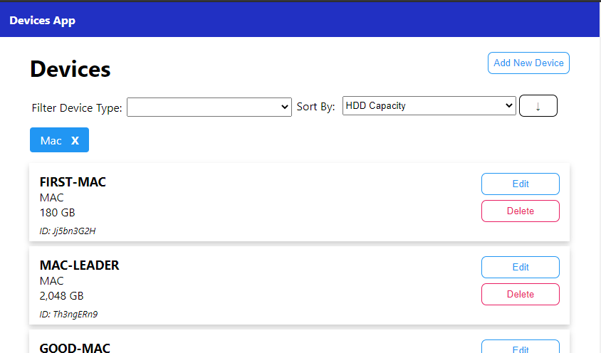

# Devices-clientapp
This is a React.js Client Web Aplpication made for **Frontend task for  NinjaRMM**. 



## Local Setup
This client web app works alongside with the [NinjaRMM Devices Task Server App](https://github.com/NinjaRMM/devicesTask_serverApp). Make sure to follow its steps to have it running in your local.

1. Clone It!
  ```
  git clone https://github.com/OscarDHdz/devices-clientapp
  ```
2. Install It!
  ```
  npm install
  ```
3. Run It!
  ```
  npm start
  ```

## Configuration
The web app configuration is located under `src/config/config.json`. Available configurations are:

* **baseUrl** - It points to the server app url, change it if yours is running in a different place than `http://localhost:3000`
* **systemTypes** - Available System Types. Used for Form fields & Filtering Option
* **sortOptions** - Available Sort Options for Devices List

## Test
The project inlcudes the following test capabilities:

### Unit Test
This projects runs unit test using [Jest](https://jestjs.io/). To execute the suite just run:
```
npm test
```
Or if you need a coverage report, use:
```
npm run test -- --coverage
```


